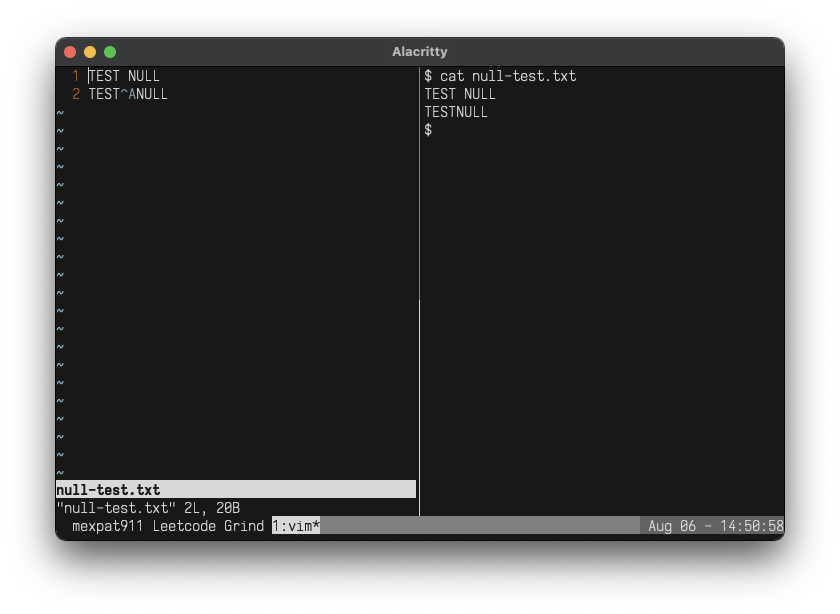

This is entry `6/150` in the NeetCode150 Challenge.

### Problem

The problem states:

> Design an algorithm to encode a list of strings to a string. The encoded string is then sent over the network and is decoded back to the original list of strings.

This confused me immensely. When I think about how packets are sent over the network, I immediately think bytes. However, the problem does not state this is what we need. Terrible wording. All we need is a cheap serializing function. The key in the question was that the `encode()/decode()` function requires ONE string (both to send and receive). Therefore, we can use a delimeter to "encode" the list into one string, and then split on this delimiter later on.

### Choosing delimeter

After working in FinTech for so long, it's still interesting to see how data gets shuffled around. Obviously we can use any delimeter, but a common delimeter that almost nobody ever uses is the `SOH` character. You've probably never seen it, unless you turn on nonprintable chars or have used FIX messaging. Reference the following image so you can see how vim renders the text vs. a simple cat:



This will work for this use case. The `SOH` char is rarely used, so we can be certain that this won't interfere with any other printable characters that are used as delimeters in other cases (`; | \ /`).

### Code

Here is what I came up with:

```python
class Codec:
    def encode(self, strs: List[str]) -> str:
        """Encodes a list of strings to a single string.
        """
        return '\1'.join(strs)

    def decode(self, s: str) -> List[str]:
        """Decodes a single string to a list of strings.
        """
        return s.split('\1')

# Your Codec object will be instantiated and called as such:
dummy_input = ["Hello","World"]
codec = Codec(
```

### Outro

Over all this was an easy module, but be careful what delimeters you use. It helps if you think yourself as a user generating this message. For delimeters, using a nonprintable character is a good way to avoid conflicts.

I stream these Neetcode problems on Twitch and have the recordings on YouTube. You can watch me attempt this module or follow me on any of the links below.

👇

[Neetcode 6/150 - Encode and Decode Strings](https://youtu.be/sMicHLOqvHY)

[Twitch](https://twitch.tv/Mexpat911)

[YouTube](https://www.youtube.com/@mexpat911)
